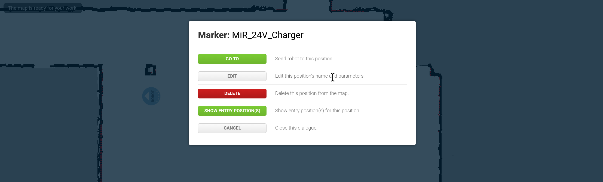

# MiR

**Model: MiR 200**

## Power on

- Power button on front right (bottom)
- Hold briefly to turn on
- If power cycled (hear relay clicking, light flashes red), means out of battery; Charge with small charger

## Connect

- Find wireless network `MiR_...`
- Turn off any DNS servers (if applicable)
- Open [mir.com](http://mir.com)

## Dock & Charge

- Manually push it off the docking station first.
- Disengage e-stop.
- In portal > map, click on dock & "GO TO". 
- in portal > top, click on play to proceed with missions.
- Wait.
- Verify power percentage going up.

---

# UR Arm

**Model: UR 10, PolyScope 3.13.1 (a CB3 controller)**

- Turn on everything within.
- Turn on teach pendant.
- On teach pendant: Setup > Network > Static IP > Set
```
IP: 192.168.1.20
Subnet: 255.255.255.0
Gateway: 0.0.0.0
DNS1: 192.168.1.1
DNS2: 192.168.0.1
```
- Connect via ethernet cable (or, via router)

## Robotiq Camera
> https://robotiq.com/support

- Download Robotic wrist camera drivers
- Extract to FAT32 drive root
- Install onto UR Teach Pendant via Setup > URCaps > `+`
- Reboot
- Install vision server (same steps)
- Reboot
